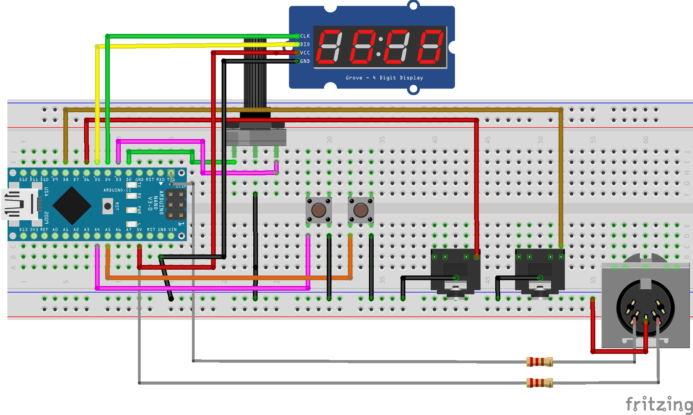

# arduino-midi-sync #

It is a FORK:

Arduino MIDI master clock/sync/divider for MIDI instruments, Pocket Operators and Korg Volca.

Detail is here : https://ejlabs.net/arduino-midi-master-clock/

MIDI Clock EFX version : https://github.com/ejlabs/arduino-midi-sync/tree/Sample-EFX

### Requirements ###

* IDE Arduino 1.8.12
* library TM1637 1.2.0 by Avishay Orpaz
* library TimeOne 1.10 
* library Encoder 1.4.1 by Paul Stoffregen
* library Arduino MIDI Library v4.3.1 by FortySevenEffects

